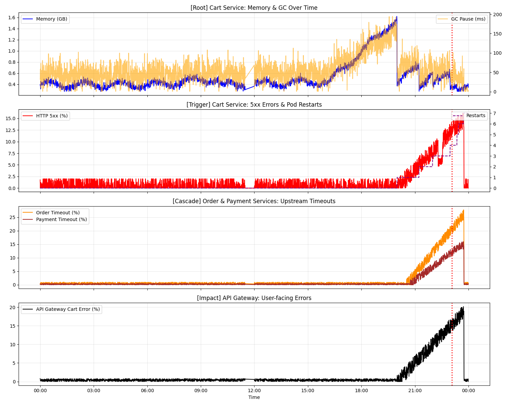
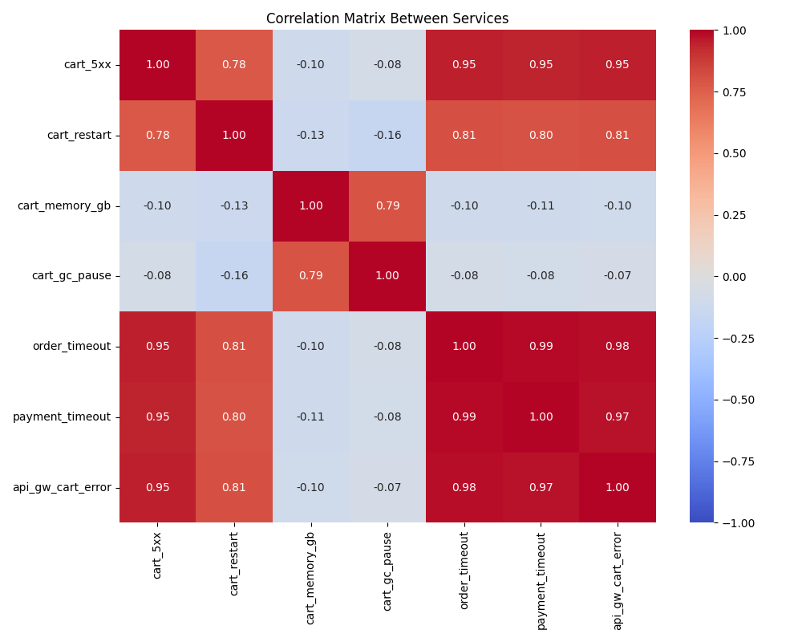
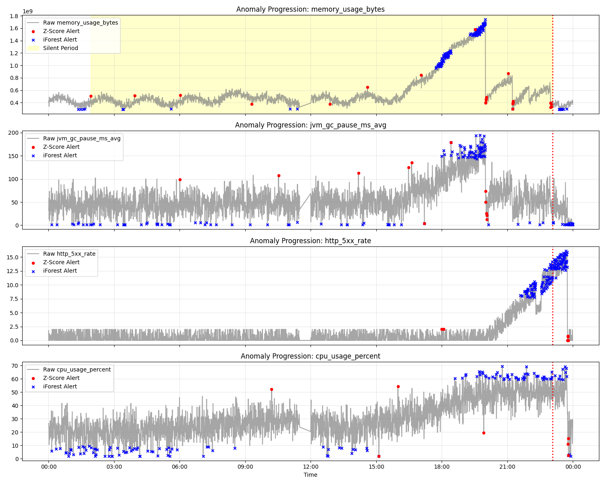

# AIOps Lab W1 - Postmortem Report

## Executive Summary

Vào lúc 23:04 ngày 2026-06-01, hệ thống giám sát đã nhận được hàng loạt cảnh báo (alert) nghiêm trọng liên quan đến việc tăng vọt HTTP 5xx rate (lên tới 34%) và Pod restart liên tục (7 lần) ở `cart-service`.
Sau khi phân tích dữ liệu đa chiều (Multi-service Metrics & Logs Fusion), chúng tôi đã xác định được đây là một **Sự cố Sập dây chuyền (Cascading Failure)** bắt nguồn từ một lỗi **Memory Leak** âm ỉ trong `cart-service`. Tín hiệu bất thường đầu tiên đã xuất hiện trước đó hơn 21 tiếng, nhưng không được cảnh báo kịp thời.

---

## WHEN - Timeline Analysis

Thông qua thuật toán Anomaly Detection (Z-score & Isolation Forest), chúng tôi đã cô lập được **Silent Period** (Giai đoạn chìm) kéo dài từ rạng sáng đến đêm khuya trước khi hệ thống vỡ trận:

- **[01:55:30] First Silent Signal:** memory_usage_bytes = 1.42GB (↑12% from baseline 1.27GB), Z-score = 3.4
- **[06:30:19] JVM GC Warning:** Log: `GC overhead limit warning: pause=384ms heap=88%`. GC pause time tăng đột biến, heap utilization đạt 88%.
- **[06:32:33] First Error Root Cause:** Log ERROR đầu tiên: `ProductCatalogCache eviction failed: heap pressure too high`. _Đây là smoking gun - cache không thể evict do heap đầy._
- **[19:03:30] Multivariate Anomaly (Isolation Forest):** IF model (contamination=0.05) detect anomaly dựa trên 4 metrics. Memory đạt ~1.85GB (92% limit).
- **[19:59:00] First OOM Danger:** Log FATAL: `OutOfMemoryError imminent: available heap < 5%`. Chỉ còn ~100MB RAM khả dụng.
- **[23:04:00] Alert Triggered:** HTTP 5xx rate = 34% (threshold: 5%), container_restart_count = 7. OOMKilled → restart loop confirmed.

---

## WHERE - Root Cause Service & Metric

- **Service bắt nguồn (Root Cause Service):** `cart-service`.
- **Leading indicator (Chỉ báo sớm nhất):** `memory_usage_bytes` của `cart-service`.
- **Cascading Failures (Hiệu ứng dây chuyền):**
  Sự nghẽn cổ chai tại `cart-service` khiến các service phụ thuộc bị vạ lây. `order-service` và `payment-service` ghi nhận sự tăng đột biến của `upstream_timeout_rate` (Timeout do chờ Cart). Cuối cùng, `api-gateway` ghi nhận lỗi trả về trực tiếp cho user (`cart_upstream_error_rate`).

---

## WHAT - Root Cause Hypothesis

**Cơ chế sinh lỗi (Mechanism):**

1. **Memory Leak do Cache:** `cart-service` sử dụng `ProductCatalogCache` để lưu đệm dữ liệu sản phẩm. Tuy nhiên, logic xóa bộ nhớ đệm (eviction) bị lỗi, khiến nó liên tục giữ lại dữ liệu cũ.
2. **GC Overhead & OOM:** Bộ nhớ (Heap) bị ăn mòn lên tới >88%. Java GC cố gắng giải phóng bộ nhớ nhưng thất bại, dẫn đến CPU tăng vọt và ứng dụng treo. Khi RAM cạn kiệt (<5%), lỗi `OutOfMemoryError` xảy ra.
3. **Restart Loop & Timeout:** Kubernetes thấy Pod vượt mức Memory Limit (2GB) nên đã `OOMKilled` và khởi động lại. Nhưng vì code vẫn lỗi, Pod cứ khởi động lên lại bị rò rỉ RAM tiếp, tạo thành vòng lặp (Restart Loop). Trong lúc Pod khởi động lại, các request từ `order-service` đẩy tới bị kẹt cứng gây ra Timeout hàng loạt.

---

## Lessons Learned & Recommendations

1. **Tinh chỉnh Alerting:**
   - **(Immediate)** Cần cài đặt alert sớm cho Metric `jvm_gc_pause_ms_avg` (GC pause quá cao) và `memory_usage_bytes` chạm ngưỡng 80% limit thay vì đợi đến khi Pod bị kill.
2. **Kiểm tra Code (Hotfix):**
   - Kiểm tra lại logic của thư viện Cache (ví dụ: Guava, Caffeine) trong `cart-service`. Cần đảm bảo có cơ chế `expireAfterWrite` hoặc `maximumSize`.
3. **Infrastructure:**
   - Cân nhắc tăng tạm thời (Temporary Tweak) giới hạn Memory Limit từ 2GB lên 3GB trong lúc chờ đội Dev fix code để giảm tần suất Restart Loop, cứu vãn trải nghiệm người dùng.

---

## Evidence

### Multi-service Timeline

### Correlation Heatmap  

### Anomaly Detection Results

### Log Analysis Output
See detailed analysis in `notebooks/03-log_metrics_fusion.txt`:
- First GC warning: 06:30:19
- First cache failure: 06:32:33
- OOM imminent: 19:59:00
