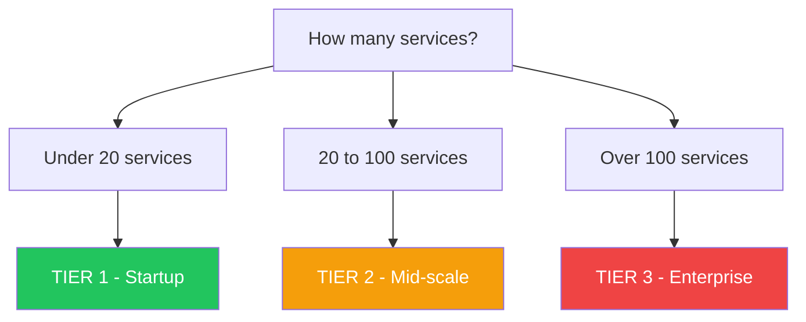
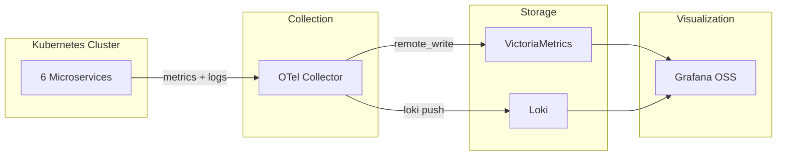
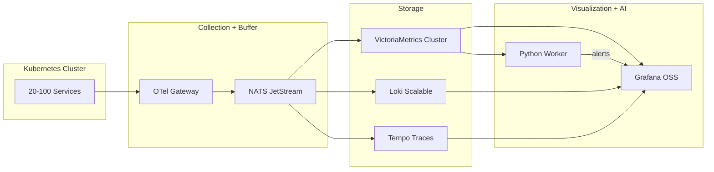
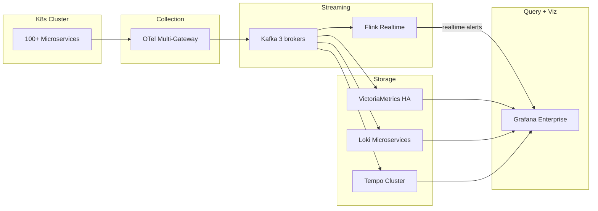

# Observability Stack — Lua chon Cong nghe theo Quy mo

## Goc nhin: Cau hoi dung khong phai "Dung gi re nhat?" ma la "He thong cua minh o dau tren ban do?"

> **Sai lam pho bien nhat: Copy y nguyen kien truc cua Netflix/Google roi nhet vao startup 5 nguoi.**

---

## Buoc 1: Xac dinh Quy mo he thong (Decision Tree)

**ShopX (bai Lab) = 6 services -> TIER 1**

---

## Buoc 2: Chon Stack theo tung Tier

### TIER 1: Startup / SME

| Thanh phan | Cong nghe | RAM | Vai tro |
|---|---|---|---|
| Collection | OTel Collector DaemonSet | 256 MB | Thu thap signals |
| Metrics | VictoriaMetrics single | 1-2 GB | Luu va query metrics |
| Logs | Loki single-binary | 1-2 GB | Luu va query logs |
| Dashboard | Grafana OSS | 256 MB | Hien thi + Alert |
| AI | Python CronJob | 512 MB | Z-Score + IF moi 5 phut |
| **Tong RAM** | | **~4 GB** | |
| **Chi phi** | | **$0** | |

---

### TIER 2: Mid-scale (20-100 services)

| Thanh phan | Cong nghe | Thay the | Ly do |
|---|---|---|---|
| Message Queue | NATS JetStream | Kafka | Nhe hon 10x: 50 MB vs 4 GB |
| Metrics | VM Cluster | Prometheus | Scale horizontal |
| Logs | Loki Scalable | Elasticsearch | Re hon 10x |
| Traces | Tempo | Jaeger | Native voi Grafana |
| **Tong RAM** | | | **~16-24 GB** |

---

### TIER 3: Enterprise (100+ services)

| Thanh phan | Cong nghe | Ly do |
|---|---|---|
| Kafka | 3+ brokers | Buffer manh cho 50K+ msg/s |
| Flink | Apache Flink | Anomaly Detection realtime |
| Grafana | Enterprise | SSO, RBAC, SLA |
| **Tong RAM** | | **~64-128 GB** |

---

## Buoc 3: Bang so sanh tong quan

| Tieu chi | Tier 1 ShopX | Tier 2 | Tier 3 |
|---|---|---|---|
| Services | Under 20 | 20-100 | Over 100 |
| Collection | OTel | OTel + NATS | OTel + Kafka |
| Processing | Python CronJob | Python Worker | Flink |
| Metrics | VM single | VM Cluster | VM Cluster HA |
| Logs | Loki single | Loki scalable | Loki microservices |
| Traces | Khong can | Tempo | Tempo Cluster |
| Dashboard | Grafana OSS | Grafana OSS | Grafana Enterprise |
| RAM | **~4 GB** | ~16-24 GB | ~64-128 GB |
| Chi phi/thang | **~$20-50** | ~$200-500 | ~$2,000-5,000 |
| Doi van hanh | 1 nguoi | 2-3 SRE | 5-10 SRE |

---

## Ket luan

ShopX co 6 services -> **Tier 1 la toi uu nhat**.

So do ban dau (Kafka + Flink + ES + Kibana) la **Tier 3** cho he thong chi can **Tier 1** = **Over-engineering**.

> **Nguyen tac vang:** Bat dau tu Tier 1. Traffic x10 -> Tier 2. Traffic x100 -> Tier 3.
